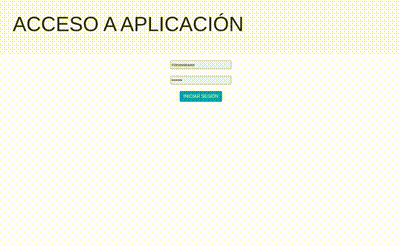

# ComuniApp
Aplicación de gestión de Comunidades de propietarios

Realizada en PHP siguiendo el patrón de diseño MVC

* MySQL
* Bootstrap
* Uso de la librería DOMPDF para generar pdf. 
* Uso de PHPMailer para envío de correos desde la aplicación.

## Últimas actualizaciones:
* Aviso en icono de envío de recibos
* Rediseño apartado CONTADORES
* Añadida opción ADMINISTRAR USUARIOS APLICACIÓN solo para admin de la app
* ...

